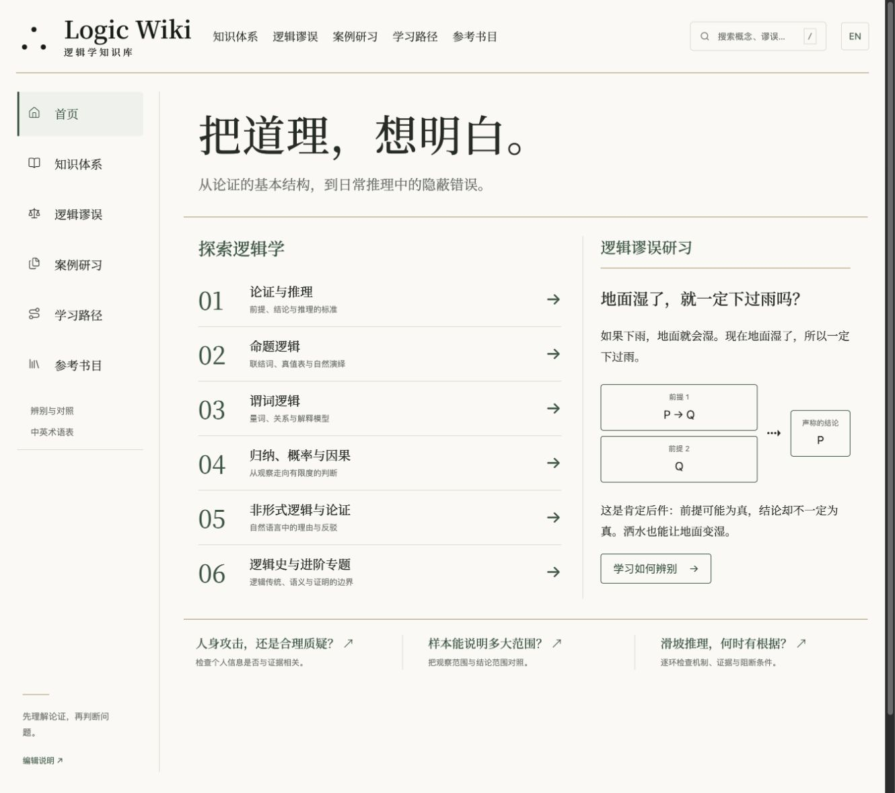

<div align="center">


# Logic Wiki · 逻辑学知识库

**学会拆解论证，辨别推理中的错误。**<br />
Learn to analyze arguments and recognize errors in reasoning.

[](https://github.com/Horace-Maxwell/logic-wiki/actions/workflows/quality.yml)   

[内容地图 · Contents](#contents) · [阅读体验 · Reading](#reading) · [快速开始 · Quick start](#quick-start) · [参与编辑 · Contribute](#contribute)

</div>

中英双语逻辑学知识库，适合从前提与结论开始学习，也适合查阅某个谬误、比较相近概念或练习形式证明。每篇文章都有完整中文与英文版本；谬误词条结合原创案例、非谬误对照和带解析练习，说明错误发生在哪里、什么情况下不能这样判断。

A Chinese–English knowledge base for learning logic, looking up fallacies, comparing related concepts, and practicing formal proofs. Every article has a complete version in both languages. Fallacy entries use original examples, non-fallacious contrasts, and explained exercises to show where an inference fails and when the same diagnosis would be unwarranted.

<p align="center">
  
  <br />
  <sub>本地网站实拍 · Screenshot of the local site</sub>
</p>

<table>
  <tr>
    <th align="center">40</th>
    <th align="center">100</th>
    <th align="center">30</th>
    <th align="center">312</th>
  </tr>
  <tr>
    <td align="center">基础与进阶导读<br />Guides</td>
    <td align="center">谬误与推理错误词条<br />Fallacies &amp; reasoning errors</td>
    <td align="center">真实案例专题<br />Real case studies</td>
    <td align="center">带解析练习<br />Explained exercises</td>
  </tr>
</table>

数量按知识单元计算，中英文不重复计数。312 道练习包含 202 道选择题和 110 道分步解答题。<br />
Counts refer to distinct units, not translations. The 312 exercises comprise 202 multiple-choice questions and 110 worked-response problems.

<a id="contents"></a>

## 内容地图 · What you can study

| 主线 · Subject | 学习内容 · Topics |
| :--- | :--- |
| **01 · 论证与推理 / Arguments and inference** | 前提、结论、有效性与健全性 / Premises, conclusions, validity, and soundness |
| **02 · 命题逻辑 / Propositional logic** | 联结词、真值表、自然演绎 / Connectives, truth tables, and natural deduction |
| **03 · 谓词逻辑 / Predicate logic** | 量词、关系、解释模型 / Quantifiers, relations, and interpretations |
| **04 · 归纳、概率与因果 / Induction, probability, and cause** | 证据强度、概率判断、因果推断 / Evidential strength, probability, and causal inference |
| **05 · 非形式逻辑与论证 / Informal logic and argument** | 日常理由、论证重构、反驳与谬误 / Everyday reasons, argument reconstruction, objections, and fallacies |
| **06 · 逻辑史与进阶专题 / History and further study** | 逻辑传统、语义、证明的边界 / Logical traditions, semantics, and the limits of proof |

完整目录见 [内容地图 / Content map](docs/CONTENT-MAP.md)。网站提供三条学习路径：第一次学逻辑、辨别日常论证、形式化与证明。<br />
The site offers three reading paths: a first course in logic, evaluating everyday arguments, and formalization and proof. See the content map for the full inventory.

### 谬误，怎么区分？ · Telling fallacies apart

每个错误词条至少包含 **2 个原创案例、1 个非谬误对照、2 道带完整解析的练习**。练习使用区别于已解案例的新情境；适用时允许“信息不足”或有依据的多种解释。

Each error entry includes **at least 2 original examples, 1 non-fallacious contrast, and 2 exercises with full explanations**. Exercises use situations distinct from the worked examples; insufficient information and multiple supported interpretations are allowed where appropriate.

| 对照专题 · Comparison | 判断时检查什么 · What to check |
| :--- | :--- |
| 人身攻击 / 可信度审查<br />Personal attack / Credibility assessment | 个人信息是否影响当前证言的可靠性？<br />Does the personal information affect the reliability of this testimony? |
| 诉诸权威 / 专家证言<br />Appeal to authority / Expert testimony | 专业是否相关，证据是否可查？<br />Is the expertise relevant, and can the evidence be checked? |
| 滑坡 / 风险推演<br />Slippery slope / Risk analysis | 因果链条的每一步有什么支持？<br />What supports each step in the causal chain? |
| 诉诸无知 / 缺失证据<br />Appeal to ignorance / Absence of evidence | 如果目标存在，检查方法能否发现？<br />If the target existed, would the method detect it? |
| 肯定后件 / 溯因<br />Affirming the consequent / Abduction | 是断言必然，还是比较可能的解释？<br />Is the claim one of necessity, or a comparison of possible explanations? |
| 忽略基率 / 倒置条件<br />Base-rate neglect / Reversed conditioning | 遗漏了先验比例，还是混淆了条件方向？<br />Is a prior missing, or has the direction of conditioning been reversed? |

分类服务于学习；认知偏差、统计现象与逻辑谬误会区分标注。这 100 个词条不代表学界公认且穷尽的谬误清单。<br />
The taxonomy is a learning aid. Cognitive biases, statistical phenomena, and logical fallacies are labeled distinctly; these 100 entries are not a universally agreed or exhaustive list.

<a id="reading"></a>

## 阅读体验 · Reading experience

| 功能 · Feature | 使用方式 · How it works |
| :--- | :--- |
| 双语阅读 / Bilingual reading | `/zh/` 与 `/en/`；切换保留词条、查询和章节位置，记住主动选择。<br />Switch languages while keeping the article, query, and section; your language preference is remembered. |
| 逐节对照 / Parallel text | `/zh/bilingual/<id>/`；桌面双栏，手机按节呈现两种语言。<br />Side-by-side sections on desktop; paired sections on mobile. |
| 搜索与术语 / Search and terminology | `/zh/search/` 按中英名称、别名与内容检索；支持类型筛选。`/zh/glossary/` 收录双语术语。<br />Search titles, aliases, and content in either language, filter by type, and consult the bilingual glossary. |
| 案例与练习 / Cases and exercises | 按步骤展开分析、查看原文；选择题答案保存在当前浏览器，对照页同步作答。<br />Reveal analysis step by step, inspect original passages, and save multiple-choice answers in the browser with synchronized parallel views. |
| 公式与论证 / Formulas and arguments | 真值表、有限反模型、论证图、反向链接与打印样式。<br />Truth tables, finite countermodels, argument diagrams, backlinks, and print layouts. |

同一题的双语内容或答案变更后，旧作答自动失效。40 篇导读各有 2 道分步解答题，30 篇真实案例各有 1 道。<br />
Saved answers expire when either language version or the answer changes. Each of the 40 guides has 2 worked-response problems, and each of the 30 case studies has 1.

<a id="quick-start"></a>

## 快速开始 · Quick start

需要 **Node.js 22.12+**；CI 使用 Node 24。本仓库公开源码，网站在本地运行。<br />
Requires **Node.js 22.12+**; CI uses Node 24. The source is public; the website runs locally.

```sh
git clone https://github.com/Horace-Maxwell/logic-wiki.git
cd logic-wiki
npm ci
npm run dev
```

打开 [中文首页](http://127.0.0.1:4321/zh/) 或 [English home](http://127.0.0.1:4321/en/)。若端口被占用，以终端显示的地址为准。<br />
Open either home page above. If the port is occupied, use the address printed in your terminal.

完整 Pagefind 全文搜索需要生产构建；开发模式可搜索中英名称、别名和摘要。<br />
Full Pagefind search requires a production build. Development mode supports titles, aliases, and summaries in both languages.

```sh
npm run build
npm run preview -- --port 4322
```

生产预览：[中文](http://127.0.0.1:4322/zh/) · [English](http://127.0.0.1:4322/en/)。静态产物位于 `dist/`。<br />
Production previews are linked above; static output is written to `dist/`.

<details>
<summary>开发与数据接口 · Development and data exports</summary>


技术栈：Astro、TypeScript、MDX；React 用于交互，KaTeX 输出公式与 MathML，Pagefind 提供生产全文检索。核心数据保存在 `src/data/`，两种语言共享稳定 ID、事实、公式、来源与答案，无需运行时数据库。

The stack uses Astro, TypeScript, and MDX, with React for interactions, KaTeX for formulas and MathML, and Pagefind for production search. Core data lives in `src/data/`; both languages share stable IDs, facts, formulas, sources, and answers. No runtime database is required.

| 构建输出 · Build output | 内容 · Contents |
| :--- | :--- |
| `/api/index.json` | 170 个单元的双语标题、别名、章节、反向链接与题目索引。<br />Bilingual titles, aliases, sections, backlinks, and exercise indexes for 170 units. |
| `/api/zh/<id>.json` · `/api/en/<id>.json` | 共 340 份单语言文件，包含稳定 ID、双语版本哈希与中文依据版本。<br />340 language-specific files with stable IDs, bilingual version hashes, and the Chinese source-version reference. |

Astro 7 会报告开发服务 PID，可用 `npx astro dev stop` 停止对应服务。当前站点地图采用本地开发地址；将来若部署，须设置真实的 `SITE_URL` 后重建。依赖、构建产物及本地凭据不纳入版本控制。

Astro 7 reports the development server PID; use `npx astro dev stop` to stop the relevant service. The sitemap currently uses the local development address. Any future deployment needs a rebuild with the actual `SITE_URL`. Dependencies, build output, and local credentials are excluded from version control.

</details>

## 来源与编辑 · Sources and editing

99 条来源记录涵盖学术参考、开放教材、书籍、原始材料、通俗阅读、大学课程和 GitHub 资源。每条记录区分实际查阅范围：正文、相关章节、摘要、节选、概述或仅书目。网站的 `/zh/sources/` 与 `/en/sources/` 提供筛选与检索。

The 99 source records cover scholarly references, open textbooks, books, primary documents, accessible introductions, university courses, and GitHub resources. Each specifies what was actually consulted: full text, relevant sections, abstract, excerpt, overview, or bibliographic information only. The source pages in both languages support filtering and search.

教材与参考入口包括 *forall x: Calgary*、Open Logic Project、SEP、IEP，以及香港大学 Critical Thinking Web。具体版本、定位、查阅范围及许可见[来源登记](src/data/sources.mjs)与[延伸阅读](src/data/reading.mjs)。

Textbook and reference entry points include *forall x: Calgary*, the Open Logic Project, SEP, IEP, and the University of Hong Kong's Critical Thinking Web. Consult the source register and further-reading records for versions, locators, access scopes, and licenses.

### Humanizer 是编辑流程的一部分 · Humanizer in the editorial process

项目固定使用 [blader/humanizer](https://github.com/blader/humanizer) **3.0.0** 与 [humanizer-zh-cn](https://github.com/holygeek00/humanizer-zh-cn) **2.9.1-zh.2**，上游规则及 MIT 许可证保存在 [vendor/humanizer/](vendor/humanizer/)。写作代理执行语言编辑，再单独核对学术语义与中英对应关系。网站运行时不调用 Humanizer，构建也不自动更新规则。

The project pins **3.0.0** of blader/humanizer and **2.9.1-zh.2** of humanizer-zh-cn, retaining upstream rules and MIT licenses in the vendor directory. A writing agent edits the prose, then separately checks academic meaning and bilingual equivalence. Humanizer is not called at runtime, and builds do not update its rules.

审校记录绑定双语内容、来源、术语表与编辑规则的哈希；改动会使对应记录失效。否定、量词、条件、不确定性和证据强度必须保留。规则更新须检查差异、重跑回归，并重新编辑受影响内容。

Review receipts bind hashes of bilingual content, sources, the glossary, and editorial rules. Changes invalidate the relevant receipts. Editing must preserve negation, quantifiers, conditions, uncertainty, and evidential strength. Rule updates require a diff review, regression checks, and re-editing affected content.

全部 170 个单元已有本轮代理编辑与语义自校记录。真实案例中的论证重构是本站分析；代理审校不等于独立专家审稿，自动检查也不能证明自然语言论证正确或译文等值。

All 170 units have records of agent editing and semantic self-review for this edition. Argument reconstructions in real cases are this project's analysis. Agent review is not independent expert review; automated checks cannot establish the correctness of natural-language arguments or translation equivalence.

<a id="contribute"></a>

## 参与编辑 · Contribute

发现问题可[提交 Issue](https://github.com/Horace-Maxwell/logic-wiki/issues)，附上词条 ID、语言、具体段落与可核查来源。修改正文前请阅读 [AGENTS.md](AGENTS.md)、[项目编辑技能](skills/wiki-editor/SKILL.md)与[维护说明](docs/EDITORIAL.md)，并同步处理另一语言版本及审校记录。

To report an issue, include the unit ID, language, passage, and a checkable source. Before editing, read the project instructions, editing skill, and maintenance guide linked above. Address the other language version and review receipts as part of the same change.

```sh
npm run content:check
npm test
npm run check
npm run build
```

这些检查覆盖双语完整性、引用与交叉链接、案例、公式、审校哈希、形式反例、概率计算及静态页面链接。修改交互还须在实际浏览器中验证读者流程。<br />
These checks cover bilingual completeness, citations and cross-links, examples, formulas, review hashes, formal counterexamples, probability calculations, and static-page links. Interaction changes also require testing reader flows in an actual browser.

[深化审计 · Audit](docs/EXPANSION-AUDIT.md) · [首版审校说明 · Review notes](docs/REVIEW-NOTES.md) · [编辑制度 · Editorial workflow](docs/EDITORIAL.md)

<details>
<summary>README 设计参考 · README design references</summary>


页面组织参考了 [OSSU / computer-science](https://github.com/ossu/computer-science) 的课程导航、[The Book of Secret Knowledge](https://github.com/trimstray/the-book-of-secret-knowledge) 的封面与索引，以及 [Project Based Learning](https://github.com/practical-tutorials/project-based-learning) 的分类入口。本站文案和内容说明另行撰写。

The layout draws on OSSU's curriculum navigation, The Book of Secret Knowledge's cover and index, and Project Based Learning's category links. This project's copy and content descriptions were written separately.

</details>
